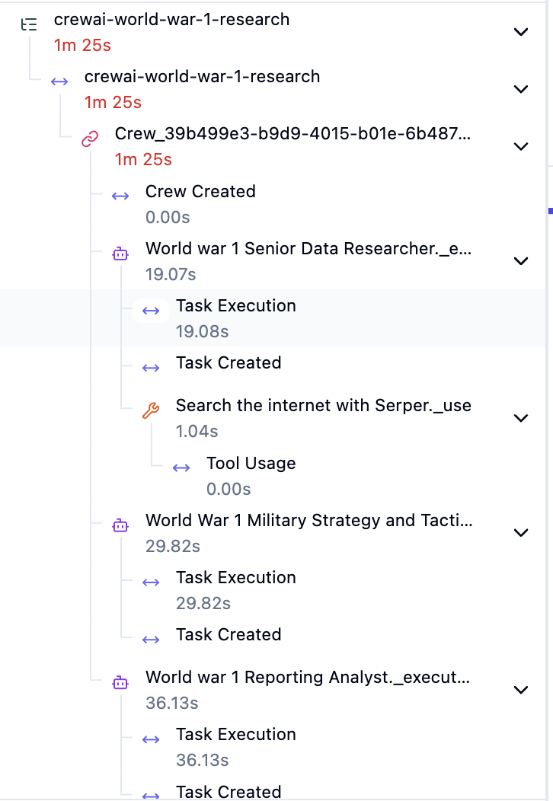
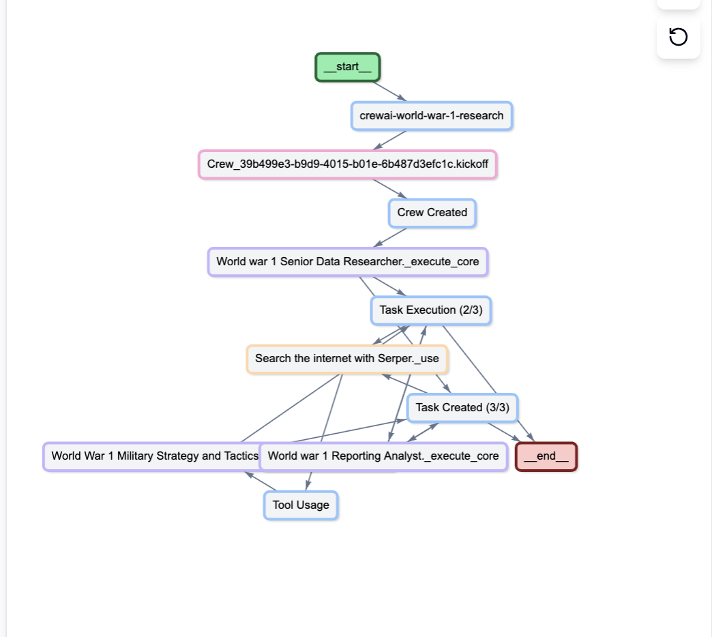
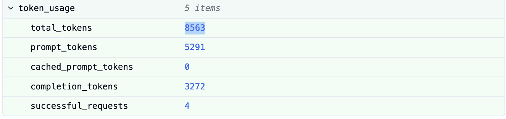
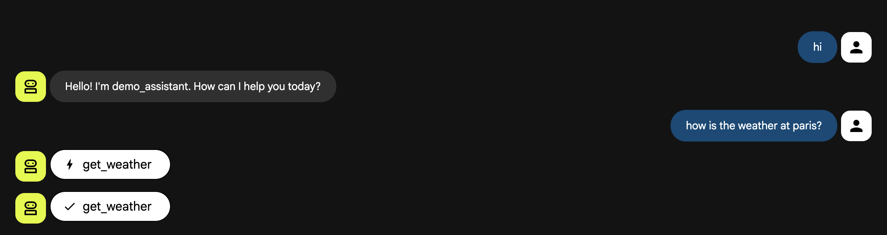
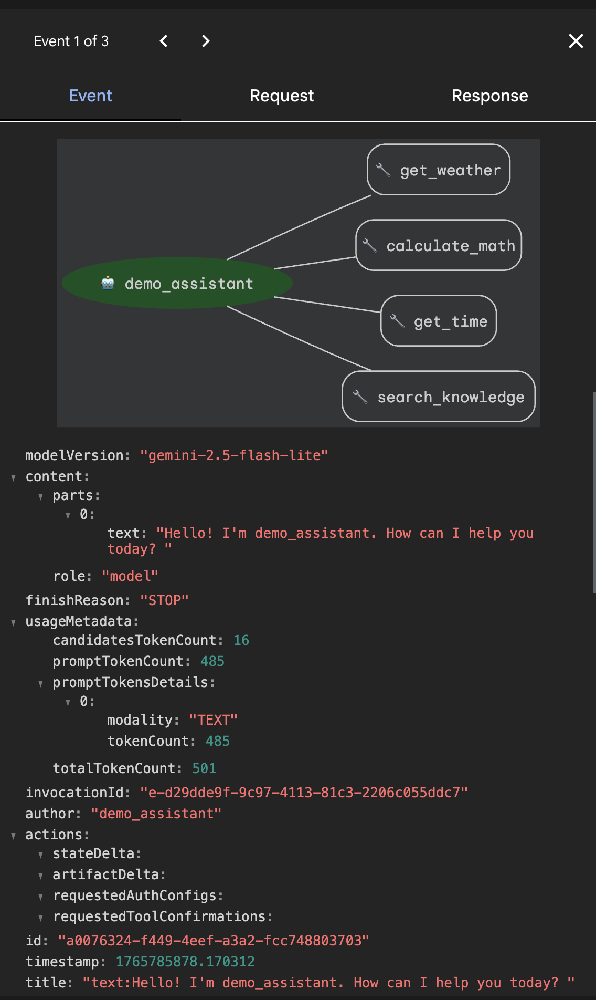
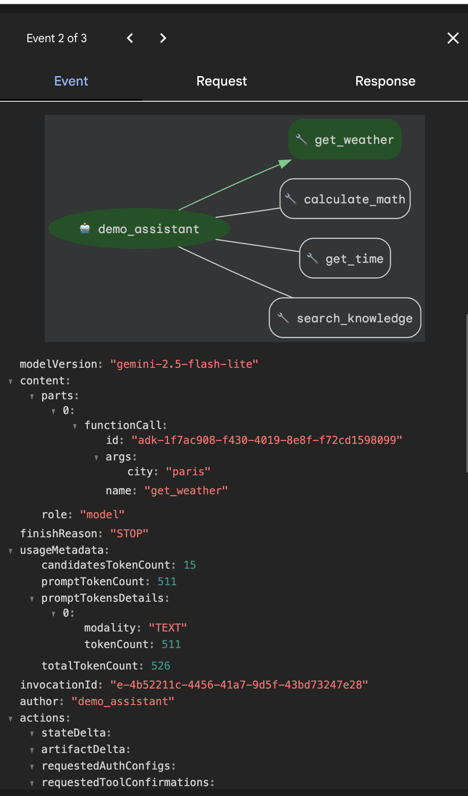
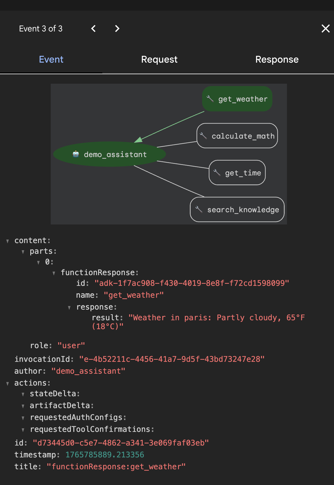

# AI Agents Observability – Classwork Submission

## 1. Student Information

* Name: Nasrallah Hasan
* Assignment Title: Crewai
* Submission Date: 15 Dec
* GitHub Repository Link:
* Video Link:

---

## 2. Overview of the Assignment

> This assignment focuses on adding observability to existing AI agents in order to track usage, logs, traces, and metrics during agent execution.

---

## 3. AI Agents Built


* **Agent framework(s) used:** CrewAI and Google ADK

### 3.1 CrewAI Multi-Agent System (`latest_ai_development/`)

**Purpose:** Research and analyze topics (e.g., World War 1) using a collaborative multi-agent approach.

**Agents:**
| Agent | Role | Purpose |
|-------|------|---------|
| **Researcher** | Senior Data Researcher | Conducts thorough research using web search (SerperDevTool) to find relevant facts |
| **Military Strategy Analyst** | WW1 Military Specialist | Analyzes military strategies, battle tactics, and technological innovations |
| **Reporting Analyst** | Report Writer | Synthesizes research and analysis into comprehensive markdown reports |

**Key Functionalities:**
- Sequential task processing (research → analysis → reporting)
- Web search integration via SerperDevTool
- Configurable LLM support via OpenRouter (GPT-4o-mini)
- YAML-based configuration for agents and tasks
- Automatic report generation (`report.md`)

### 3.2 Google ADK Agent (`adk/my_agent/`)

**Purpose:** Demonstration agent showcasing Google ADK capabilities with custom tools.

**Agent:** `demo_assistant` - A helpful assistant with 4 dummy tools

**Key Functionalities:**
| Tool | Function |
|------|----------|
| `get_weather` | Returns simulated weather data for cities |
| `calculate_math` | Performs basic math calculations |
| `get_time` | Returns current time (simulated) |
| `search_knowledge` | Searches a dummy knowledge base |

**Technical Details:**
- Uses Gemini 2.5 Flash-Lite model
- Supports both CLI (`adk run`) and Web UI (`adk web`)
- Environment-based API key configuration

---

## 4. Observability Tools Evaluated


### 4.1 CrewAI Native Tracing

* **Capabilities:** Built-in tracing via CrewAI AOP (Agent Operations Platform), captures agent thoughts, task execution, tool usage, token consumption, execution times, and cost estimates
* **Pros:** Native integration, no additional setup, detailed execution timeline, automatic trace batching
* **Cons / Limitations:** Requires CrewAI Enterprise/AOP subscription for full features, limited to CrewAI framework only

### 4.2 Opik (Comet)

* **Capabilities:** Debug, evaluate, and monitor LLM applications with comprehensive tracing, supports CrewAI integration
* **Pros:** Comprehensive evaluation tools, good visualization, integrates with Comet ML ecosystem
* **Cons / Limitations:** Requires Comet account, learning curve for full feature utilization

### 4.3 Langfuse ✅ (Selected)

* **Capabilities:** Open-source LLM engineering platform with tracing, prompt management, dataset experiments, custom scoring, user/session tracking, cost analytics
* **Pros:** Open-source, free tier available, official CrewAI integration via OpenTelemetry, rich dashboard, prompt versioning, self-hosting option
* **Cons / Limitations:** Requires additional SDK installation, cloud dependency unless self-hosted

### 4.4 AgentOps.ai

* **Capabilities:** AI agent monitoring, session replay, cost tracking, error detection
* **Pros:** Purpose-built for AI agents, easy integration, good visualization
* **Cons / Limitations:** Newer platform, smaller community, limited documentation

### 4.5 Arize Phoenix

* **Capabilities:** AI observability platform for monitoring and troubleshooting, supports OpenTelemetry
* **Pros:** Strong ML background, good for production monitoring, open-source components
* **Cons / Limitations:** More complex setup, enterprise-focused features

### 4.6 OpenLIT

* **Capabilities:** OpenTelemetry-native monitoring with one-line integration, cost tracking, performance analytics, GPU monitoring
* **Pros:** Simplest integration (one line of code), open-source, vendor-neutral, supports multiple destinations (Grafana, Datadog, etc.)
* **Cons / Limitations:** Fewer advanced features compared to Langfuse, requires OTEL collector setup for full features

---

## 5. Chosen Observability Tool

Clearly state the tool you selected.

* **Tool chosen:** Langfuse
* **Version:** langfuse >= 2.0.0, openinference-instrumentation-crewai >= 0.1.0

### 5.1 Reasons for Choosing This Tool

Explain why this tool was selected over the others.

* **Alignment with agent framework(s):** Official CrewAI integration documented on both Langfuse and CrewAI websites, uses OpenTelemetry via OpenInference SDK for automatic instrumentation
* **Ease of integration:** Simple 3-step setup - install packages, set environment variables, add 3 lines of code
* **Observability features (logs, traces, metrics):**
  - Detailed distributed tracing of agent execution
  - Token usage and cost tracking per agent/task
  - Prompt management and versioning
  - Custom scoring for quality evaluation
  - User/session tracking for multi-user scenarios
  - Dataset experiments for evaluation
* **Cost / licensing considerations:** Free tier available with generous limits, open-source with self-hosting option, no vendor lock-in
* **Developer experience:** Clean web dashboard, comprehensive documentation, active community, official integration maintained by both teams

---

## 6. Integration Details


### 6.1 Integration Architecture

* **Where observability hooks were added:** 
  - `main.py` - Langfuse client initialization and CrewAI instrumentation at application startup
  - Crew execution wrapped with Langfuse tracing spans
  
* **What events are tracked:**
  - Crew kickoff and completion
  - Individual task execution (research, analysis, reporting)
  - Agent reasoning steps and decisions
  - Tool calls (SerperDevTool web searches)
  - LLM API calls to OpenRouter/GPT-4o-mini

* **What data is collected:**
  - Input parameters (topic, metadata)
  - Output results (generated reports)
  - Token usage (input/output tokens per call)
  - Execution timestamps and duration
  - Agent/task identifiers
  - Error traces if failures occur

### 6.2 Code Integration


* **Libraries or SDKs used:**
  ```
  langfuse >= 2.0.0
  openinference-instrumentation-crewai >= 0.1.0
  ```

* **Configuration steps:**
  1. Install packages: `pip install langfuse openinference-instrumentation-crewai`
  2. Add environment variables to `.env`
  3. Initialize Langfuse client in `main.py`
  4. Initialize CrewAI instrumentation
  5. Wrap crew execution with tracing spans

* **Environment variables or API keys:**
  ```
  LANGFUSE_SECRET_KEY=sk-lf-...
  LANGFUSE_PUBLIC_KEY=pk-lf-...
  LANGFUSE_BASE_URL=https://us.cloud.langfuse.com
  ```

> **Reference files:**
> - `latest_ai_development/src/latest_ai_development/main.py` - Main integration code
> - `latest_ai_development/pyproject.toml` - Dependencies
> - `latest_ai_development/.env` - Environment configuration

---

## 7. Evidence of Observability


### 7.1 Logs

* **What is logged:**
  - Crew execution start/end events
  - Task transitions between agents
  - Tool invocations and responses
  - Completion status: ` Traces sent to Langfuse successfully!`



### 7.2 Traces

* **What agent steps are traced:**
  - Root span: `crewai-world-war-1-research` (entire crew execution)
  - Child spans for each task (research_task, military_analysis_task, reporting_task)
  - Nested spans for LLM calls within each task
  - Tool execution spans (SerperDevTool searches)



### 7.3 Metrics

* **Metrics collected:**
  | Metric | Description |
  |--------|-------------|
  | **Latency** | Total execution time, per-task duration, per-LLM-call latency |
  | **Token Usage** | Input tokens, output tokens, total tokens per call |
  | **Cost Estimate** | Approximate cost based on token usage and model pricing |
  | **Success/Failure** | Task completion status, error traces |
  | **Model Info** | Model used (openai/gpt-4o-mini), temperature, etc. |

  example:
  

  ### 7.4 Google ADK
    
    
    
    


---

## 8. Video Demonstration

📹 **Video Links:**

| Video | Description | Link |
|-------|-------------|------|
| **Video 1** |  Langfuse Traces | [Watch on Google Drive](https://drive.google.com/file/d/1lDNNnsGKBOcP3XCTt6DO_AeBNQX0N-Vo/view?usp=sharing) |
| **Video 2** | Google ADK Agent Demo | [Watch on Google Drive](https://drive.google.com/file/d/1O98uEXAhca4uRSKCMx69oAsmPHlNCk9b/view?usp=sharing) |
| **Video 3** | How to use langfuse| [Watch on Google Drive](https://drive.google.com/file/d/1RnD1XwwBbiRk3pHoV2reWYkYDGUlzQHN/view?usp=sharing) |


### 8.1 Voice-Over Summary

* **What the observability tool does:** Langfuse captures detailed traces of CrewAI agent execution, including task progression, LLM calls, tool usage, token consumption, and costs. It provides a web dashboard for visualizing and analyzing agent performance.

* **How it was integrated:** 
  1. Installed `langfuse` and `openinference-instrumentation-crewai` packages
  2. Added Langfuse API credentials to environment variables
  3. Initialized Langfuse client and CrewAI instrumentation at application startup
  4. Wrapped crew execution with tracing spans including metadata

* **Benefits of using observability for AI agents:** Enables debugging complex multi-agent workflows, monitoring production performance, tracking costs, identifying bottlenecks, and ensuring reliability through comprehensive visibility into agent behavior.

---

## 9. Benefits of Observability for AI Agents

Explain the value gained from adding observability.

* **Debugging and error analysis:** 
  - Trace exactly where failures occur in multi-agent pipelines
  - View agent reasoning and decision-making steps
  - Identify problematic tool calls or malformed responses
  - Replay failed traces to reproduce and fix issues

* **Performance monitoring:**
  - Track execution time for each agent and task
  - Identify bottlenecks (e.g., slow LLM calls or tool executions)
  - Compare performance across different models or configurations
  - Set baselines and detect performance degradation

* **Usage and cost tracking:**
  - Monitor token consumption per agent/task
  - Estimate costs based on model pricing
  - Optimize prompts to reduce token usage
  - Budget tracking and alerts for cost overruns

* **Reliability and scalability:**
  - Monitor success/failure rates in production
  - Set up alerts for anomalies or errors
  - Analyze patterns across multiple executions
  - Make data-driven decisions for scaling

---

## 10. Conclusion


In this assignment, I successfully added observability to AI agents built with two different frameworks:

1. **CrewAI Multi-Agent System:** Integrated Langfuse observability to track a 3-agent research pipeline (Researcher → Military Analyst → Reporting Analyst). The integration captures detailed traces of agent execution, task progression, tool usage, and LLM calls.

2. **Google ADK Agent:** Built a demonstration agent with custom dummy tools (weather, math, time, knowledge search) to explore Google's Agent Development Kit framework.

**Key Takeaways:**

- **Observability is essential** for production AI agents - without it, debugging multi-agent systems is nearly impossible
- **Langfuse** provides an excellent balance of features, ease of integration, and cost (free tier + open source)
- **OpenTelemetry-based instrumentation** (via OpenInference) enables automatic capture of agent behavior with minimal code changes
- **Multi-agent frameworks** like CrewAI benefit greatly from observability due to their complex task pipelines
- **Cost tracking** is crucial for LLM-based applications to manage API expenses

---
